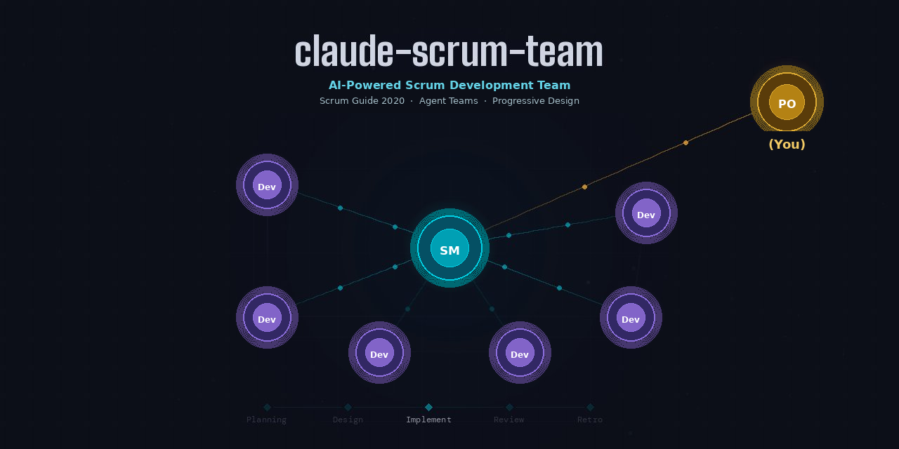

<p align="center">
  
</p>

<h1 align="center">claude-scrum-team</h1>

<p align="center">
  <strong>AI-powered Scrum team for Claude Code</strong>
</p>

<p align="center">
  <a href="https://github.com/sohei56/claude-scrum-team/blob/main/LICENSE"></a>
  
  
  
  
</p>

<p align="center">
  <a href="#why">Why?</a> &bull;
  <a href="#demo">Demo</a> &bull;
  <a href="#features">Features</a> &bull;
  <a href="#quick-start">Quick Start</a> &bull;
  <a href="#architecture">Architecture</a> &bull;
  <a href="#development">Development</a>
</p>

---

Run `scrum-start.sh` in any project directory and a full AI Scrum team takes over — a **Scrum Master** coordinates **Developer** agents through Sprint cycles while you act as the **Product Owner**, approving goals and reviewing the working product.

## Why?

Claude Code is powerful on its own, but complex projects benefit from structure. This tool gives you:

- **Structured multi-agent development** — instead of one AI doing everything sequentially, multiple Developer agents work on PBIs in parallel, each designing, implementing, and cross-reviewing independently.
- **Quality gates at every stage** — design documents are reviewed before implementation starts, cross-reviews catch issues before Sprint Review, and Integration Sprints run automated tests before you see the product.
- **Continuous improvement** — Retrospectives after each Sprint produce actionable improvements that feed into the next Sprint, so the team gets better over time.
- **Full visibility** — a real-time TUI dashboard shows you exactly what every agent is doing, what files they're changing, and how the Sprint is progressing.

## Demo

<p align="center">
  
</p>

One command sets up agents, skills, and hooks — then launches Claude Code with a Scrum Master agent alongside a real-time TUI dashboard in tmux.

### What a session looks like

1. **You describe your project** — the Scrum Master spawns a Developer to elicit requirements and write `requirements.md`
2. **Backlog Refinement** — the SM creates and refines PBIs from your requirements
3. **Sprint Planning** — the SM proposes a Sprint Goal; you approve or adjust
4. **Design + Implementation** — Developers design, then implement their PBIs in parallel
5. **Cross-Review** — each Developer reviews another's work (no self-review)
6. **Sprint Review** — the SM launches the app and demos every completed PBI; you confirm each works
7. **Retrospective** — the team reflects and records improvements for the next Sprint
8. **Repeat** until the Product Goal is achieved, then an **Integration Sprint** runs automated tests and a final UAT

## Features

- **14 ceremony Skills** covering the full Scrum lifecycle
- **Scrum Master in Delegate mode** — coordinates but never writes code
- **Parallel Developer agents** — up to 6 developers per Sprint
- **Design document governance** — catalog-controlled design specs with freeze/change process
- **Automated testing** — Integration Sprints run smoke tests, unit tests, and E2E via Playwright
- **Real-time TUI dashboard** — Sprint overview, PBI board, communication log, file changes
- **State persistence** — all state in `.scrum/` JSON files; resume any interrupted session
- **Retrospective-driven improvement** — improvements from past Sprints are applied automatically

### Sprint Lifecycle

```
Requirements Sprint ──> Backlog Refinement ──> Sprint Planning
                                                     │
                 ┌───────────────────────────────────┘
                 v
         Scaffold Design Specs ──> Spawn Teammates ──> Design Phase
                                                          │
                 ┌────────────────────────────────────────┘
                 v
         Implementation Phase ──> Cross-Review ──> Sprint Review
                                                       │
                 ┌─────────────────────────────────────┘
                 v
           Retrospective ──> [next Sprint or Integration Sprint]
                                        │
                 ┌──────────────────────┘
                 v
         Smoke Tests ──> UAT ──> Release Decision
```

## Quick Start

```bash
# Clone the repository
git clone https://github.com/sohei56/claude-scrum-team.git

# In your project directory:
cd /path/to/your/project

# Launch the Scrum team (auto-installs Python dependencies if needed)
sh /path/to/claude-scrum-team/scrum-start.sh
```

The script validates prerequisites (auto-installing `textual` and `watchdog` if missing), copies agent definitions, Skills, hooks, and the design catalog to your project's `.claude/` directory, and launches a tmux session with Claude Code (Scrum Master) and the TUI dashboard.

For detailed setup instructions, see [quickstart.md](specs/001-ai-scrum-team/quickstart.md).

### Prerequisites

- **Claude Code CLI** installed and on PATH
- **Python 3.9+** with `textual` and `watchdog`
- **tmux** (recommended) for side-by-side dashboard layout

### Your role as Product Owner

| You do | The AI team does |
|--------|-----------------|
| Describe what you want to build | Elicit and write detailed requirements |
| Approve Sprint Goals | Plan Sprints and assign PBIs |
| Review demos in the running app | Design, implement, and cross-review code |
| Report defects during UAT | Fix defects and re-test automatically |
| Make release decisions | Run automated test suites |

## Architecture

| Component | Description |
|-----------|-------------|
| `scrum-start.sh` | Entry point — validates prereqs, copies agents/skills, launches tmux |
| `agents/` | Scrum Master (Delegate mode) and Developer agent definitions |
| `skills/` | 14 ceremony Skills with mandatory Inputs/Outputs |
| `hooks/` | Phase gates, completion gates, quality gates, dashboard events, session context |
| `dashboard/app.py` | Textual TUI with real-time panels |
| `scripts/` | Status line, user setup, contributor setup |
| `.scrum/` | Runtime state (JSON, gitignored) |
| `.design/` | Design documents governed by `catalog.md` (read-only) + `catalog-config.json` (enabled list) |

## Development

See [CONTRIBUTING.md](CONTRIBUTING.md) for development setup and workflow.

```bash
# Install dev dependencies
sh scripts/setup-dev.sh

# Run tests
bats tests/unit/ tests/lint/

# Lint shell scripts
shellcheck scrum-start.sh scripts/*.sh scripts/lib/*.sh hooks/*.sh hooks/lib/*.sh
```

## License

[MIT](LICENSE)
